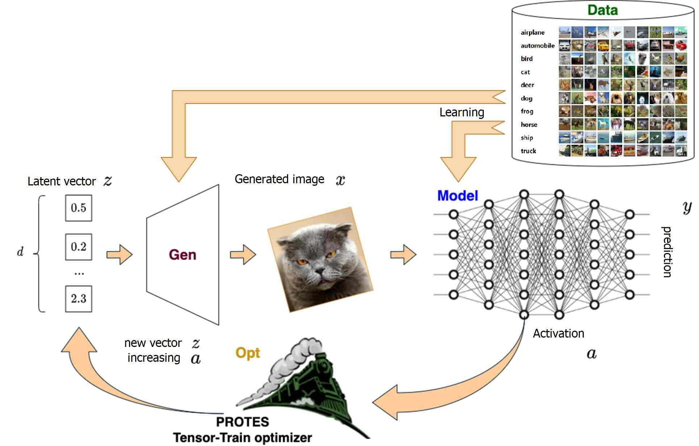

# 🥭MANGO - Maximization of neural Activation via Non-Gradient Optimization



## Description

Software product for analysis of activations and specialization in artificial neural networks (ANN), including spiking neural networks (SNN), with the tensor train (TT) decomposition and other gradient-free methods.


## Installation

1. Install [python](https://www.python.org) (version 3.8; you may use [anaconda](https://www.anaconda.com) package manager);

2. Create a virtual environment:
    ```bash
    conda create --name mango python=3.8 -y
    ```

3. Activate the environment:
    ```bash
    conda activate mango
    ```

4. install pytorch with specific cuda toolkit version
    ```bash
    conda install pytorch torchvision torchaudio pytorch-cuda=11.8 -c pytorch -c nvidia
   ```

5. (optional) install cupy for cudnn-based GPU acceleration for SNNs
    ```bash
   conda install -c conda-forge cupy cudnn cutensor
   ```
   
4. Install dependencies:
    ```bash
    pip install jupyterlab "jax[cpu]" optax teneva ttopt protes snntorch spikingjelly matplotlib nevergrad requests urllib3
    ```


## Usage

Run `python manager.py ARGS`, then see the outputs in the terminal and results in the `result` folder. Before starting the new calculation, you can completely delete or rename the `result` folder. A new `result` folder will be created automatically in this case.

> To run the code on the cluster, we used the `zhores_run.sh` bash script (in this case, the console output will be saved in a file `zhores_out.txt`).

Supported combinations of the `manager.py` script arguments:

- `python manager.py --data cifar10 --task check --kind data`

- `python manager.py --data imagenet --task check --kind data`

- `python manager.py --data cifar10 --model densenet --task check --kind model --c 0`

- `python manager.py --data imagenet --model vgg19 --task check --kind model --c 0`

- `python manager.py --data cifar10 --gen vae_vq --model densenet --task train --kind gen`

- `python manager.py --data cifar10 --gen vae_vq --model densenet --task check --kind gen`

- `python manager.py --data cifar10 --gen gan_sn --model densenet --task check --kind gen`

- `python manager.py --data cifar10 --gen vae_vq --model densenet --task am --kind class --c 0`
    > Classes may be 0, 1, ..., 9

- `python manager.py --data cifar10 --gen gan_sn --model densenet --task am --kind class --c 0`
    > Classes may be 0, 1, ..., 9


## Authors

- [Andrei Chertkov](https://github.com/AndreiChertkov)
- [Nikita Pospelov](https://github.com/niveousdragon)
- [Maxim Beketov](https://github.com/bekemax)
